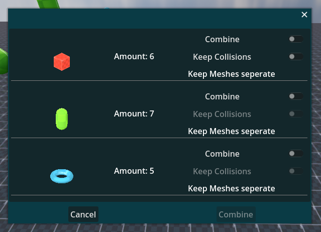

# Optiscene
Addds a mesh summarisation tool to the toolbar.

A simple tool to quickly combine meshes which have the same Mesh Resource attached to them.

## Instructions
1. Have multiple MeshInstance3Ds with the same Mesh Resource under the same parent Node
2. In the top toolbar click on *Project > Tools > Summarize MeshInstance3Ds*
3. Select which MeshInstance3Ds to combine and which to keep seperate
4. Confirm your selection with the *Combine* Button

### Notes
- Only MeshInstance3Ds with **no child Node** and **no script attached to them** will combine. This is a safety measure to not mess up your SceneTree.

## Installation Instructions
1. Clone this repository
2. Unzip the *addons* folder into your project
3. Activate the addon in your project settings